<p align="center">
    <a href="#readme">
        
    </a>
</p>

---

**Stock-Prediction-Models**, Gathers machine learning and deep learning models for Stock forecasting, included trading bots and simulations.

## Table of contents
  * [Models](https://github.com/huseinzol05/Stock-Prediction-Models#models)
  * [Agents](https://github.com/huseinzol05/Stock-Prediction-Models#agents)
  * [Data Explorations](https://github.com/huseinzol05/Stock-Prediction-Models#data-explorations)
  * [Simulations](https://github.com/huseinzol05/Stock-Prediction-Models#simulations)
  * [Results](https://github.com/huseinzol05/Stock-Prediction-Models#results)

## Contents

### Models

#### [Stacking models](stacking)
  1. Deep Feed-forward Auto-Encoder Neural Network to reduce dimension + Deep Recurrent Neural Network + ARIMA + Extreme Boosting Gradient Regressor
  2. Adaboost + Bagging + Extra Trees + Gradient Boosting + Random Forest + XGB

#### [Deep-learning models](deep-learning)
 1. LSTM Recurrent Neural Network
 2. Encoder-Decoder Feed-forward + LSTM Recurrent Neural Network
 3. LSTM Bidirectional Neural Network
 4. 2-Path LSTM Recurrent Neural Network
 5. GRU Recurrent Neural Network
 6. Encoder-Decoder Feed-forward + GRU Recurrent Neural Network
 7. GRU Bidirectional Neural Network
 8. 2-Path GRU Recurrent Neural Network
 9. Vanilla Recurrent Neural Network
 10. Encoder-Decoder Feed-forward + Vanilla Recurrent Neural Network
 11. Vanilla Bidirectional Neural Network
 12. 2-Path Vanilla Recurrent Neural Network
 13. LSTM Sequence-to-Sequence Recurrent Neural Network
 14. LSTM with Attention Recurrent Neural Network
 15. LSTM Sequence-to-Sequence with Attention Recurrent Neural Network
 16. LSTM Sequence-to-Sequence Bidirectional Recurrent Neural Network
 17. LSTM Sequence-to-Sequence with Attention Bidirectional Recurrent Neural Network
 18. LSTM with Attention Scaled-Dot Recurrent Neural Network
 19. LSTM with Dilated Recurrent Neural Network
 20. Only Attention Neural Network
 21. Multihead Attention Neural Network
 22. LSTM with Bahdanau Attention
 23. LSTM with Luong Attention
 24. LSTM with Bahdanau + Luong Attention
 25. DNC Recurrent Neural Network
 26. Residual LSTM Recurrent Neural Network
 27. Byte-net
 28. Attention is all you need
 29. Fairseq

### [Agents](agent)

1. Turtle-trading agent
2. Moving-average agent
3. Signal rolling agent
4. Policy-gradient agent
5. Q-learning agent
6. Evolution-strategy agent
7. Double Q-learning agent
8. Recurrent Q-learning agent
9. Double Recurrent Q-learning agent
10. Duel Q-learning agent
11. Double Duel Q-learning agent
12. Duel Recurrent Q-learning agent
13. Double Duel Recurrent Q-learning agent
14. Actor-critic agent
15. Actor-critic Duel agent
16. Actor-critic Recurrent agent
17. Actor-critic Duel Recurrent agent
18. Curiosity Q-learning agent
19. Recurrent Curiosity Q-learning agent
20. Duel Curiosity Q-learning agent
21. Neuro-evolution agent
22. Neuro-evolution with Novelty search agent
23. ABCD strategy agent

### [Data Explorations](misc)

1. stock market study on TESLA stock, [tesla-study.ipynb](misc/tesla-study.ipynb)
2. fashion trending prediction with cross-validation, [fashion-forecasting.ipynb](misc/fashion-forecasting.ipynb)
3. Bitcoin analysis with LSTM prediction, [bitcoin-analysis-lstm.ipynb](misc/bitcoin-analysis-lstm.ipynb)
4. Outliers study using K-means, SVM, and Gaussian on TESLA stock [outliers.ipynb](misc/outliers.ipynb)
5. Kijang Emas Bank Negara, [kijang-emas-bank-negara.ipynb](misc/kijang-emas-bank-negara.ipynb)

### [Simulations](simulation)

1. Stock market simulation using Monte Carlo, [stock-forecasting-monte-carlo.ipynb](simulation/stock-forecasting-monte-carlo.ipynb)
2. Stock market simulation using Monte Carlo Markov Chain Metropolis-Hasting, [mcmc-stock-market.ipynb](simulation/mcmc-stock-market.ipynb)

### [Tensorflow-js](stock-forecasting-js)

I code [LSTM Recurrent Neural Network](deep-learning/1.lstm.ipynb) and [Simple signal rolling agent](agent/simple-agent.ipynb) inside Tensorflow JS, you can try it here, [huseinhouse.com/stock-forecasting-js](https://huseinhouse.com/stock-forecasting-js/)

## Results

### Results Agent

**This agent only able to buy or sell 1 unit per transaction.**

1. Turtle-trading agent, [turtle-agent.ipynb](agent/1.turtle-agent.ipynb)

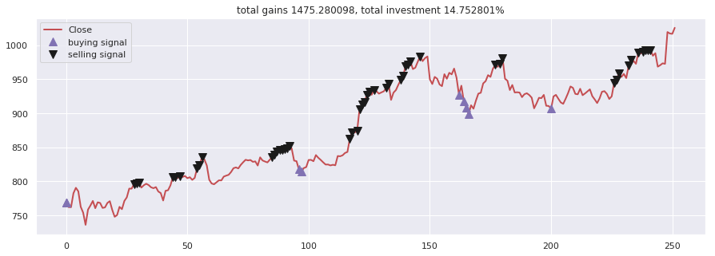

2. Moving-average agent, [moving-average-agent.ipynb](agent/2.moving-average-agent.ipynb)

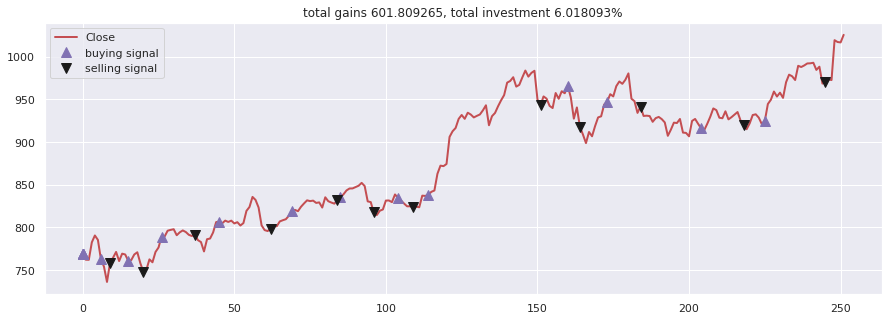

3. Signal rolling agent, [signal-rolling-agent.ipynb](agent/3.signal-rolling-agent.ipynb)

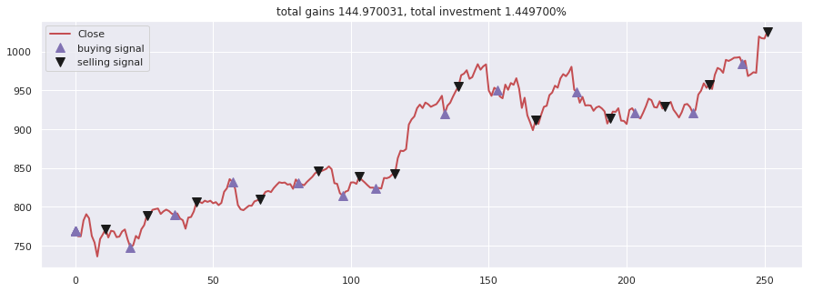

4. Policy-gradient agent, [policy-gradient-agent.ipynb](agent/4.policy-gradient-agent.ipynb)

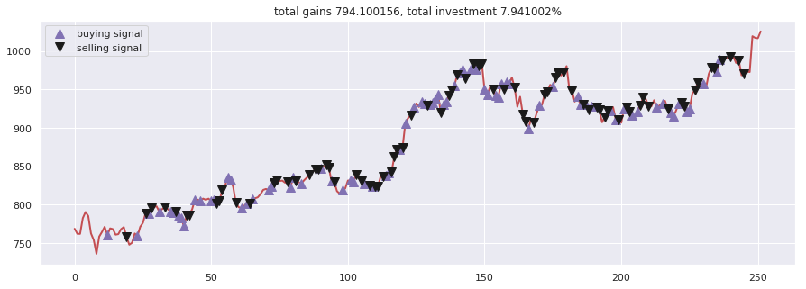

5. Q-learning agent, [q-learning-agent.ipynb](agent/5.q-learning-agent.ipynb)

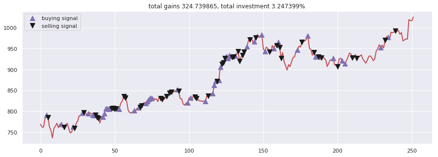

6. Evolution-strategy agent, [evolution-strategy-agent.ipynb](agent/6.evolution-strategy-agent.ipynb)

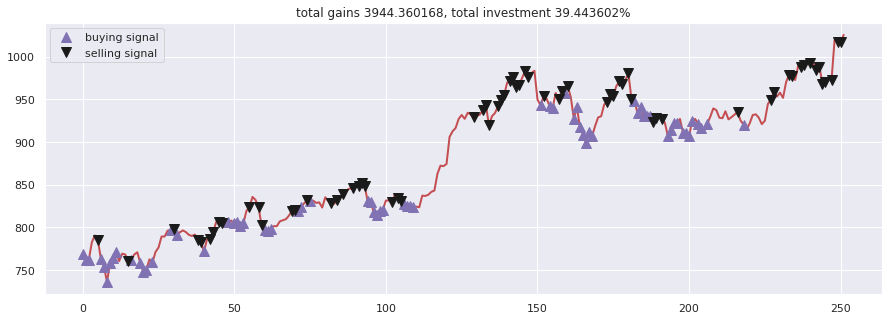

7. Double Q-learning agent, [double-q-learning-agent.ipynb](agent/7.double-q-learning-agent.ipynb)

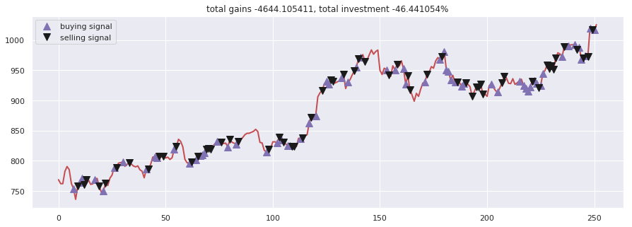

8. Recurrent Q-learning agent, [recurrent-q-learning-agent.ipynb](agent/8.recurrent-q-learning-agent.ipynb)

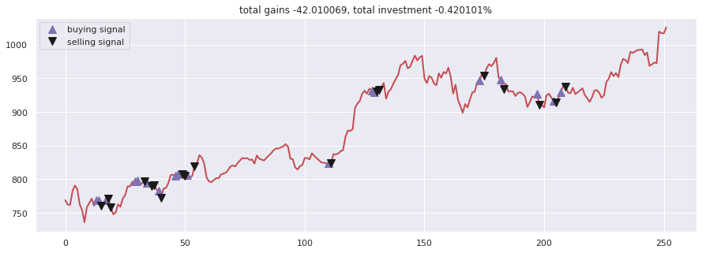

9. Double Recurrent Q-learning agent, [double-recurrent-q-learning-agent.ipynb](agent/9.double-recurrent-q-learning-agent.ipynb)

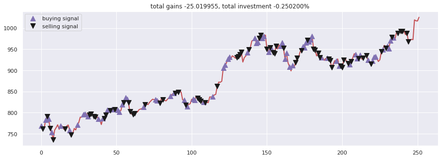

10. Duel Q-learning agent, [duel-q-learning-agent.ipynb](agent/10.duel-q-learning-agent.ipynb)


11. Double Duel Q-learning agent, [double-duel-q-learning-agent.ipynb](agent/11.double-duel-q-learning-agent.ipynb)

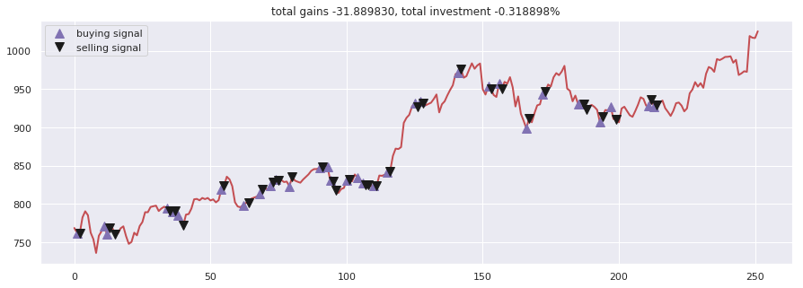

12. Duel Recurrent Q-learning agent, [duel-recurrent-q-learning-agent.ipynb](agent/12.duel-recurrent-q-learning-agent.ipynb)

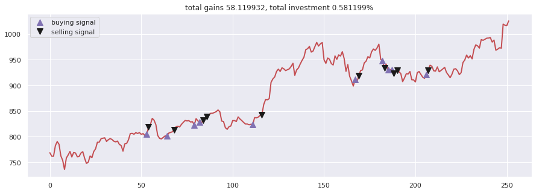

13. Double Duel Recurrent Q-learning agent, [double-duel-recurrent-q-learning-agent.ipynb](agent/13.double-duel-recurrent-q-learning-agent.ipynb)

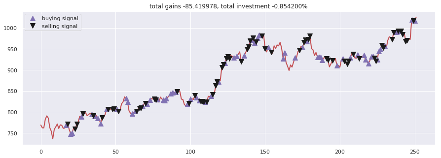

14. Actor-critic agent, [actor-critic-agent.ipynb](agent/14.actor-critic-agent.ipynb)

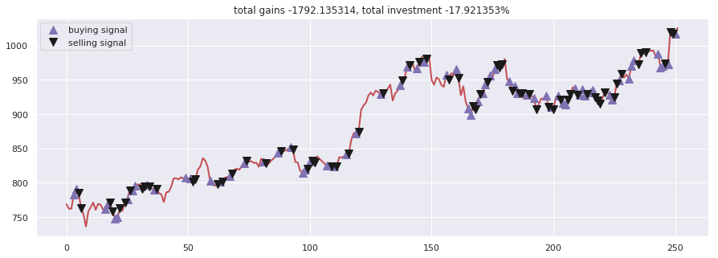

15. Actor-critic Duel agent, [actor-critic-duel-agent.ipynb](agent/14.actor-critic-duel-agent.ipynb)

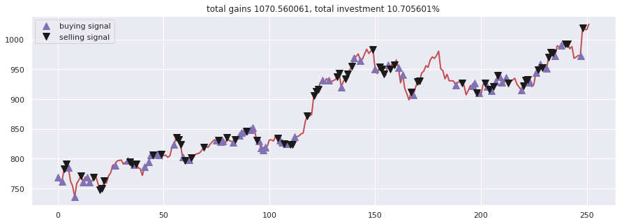

16. Actor-critic Recurrent agent, [actor-critic-recurrent-agent.ipynb](agent/16.actor-critic-recurrent-agent.ipynb)

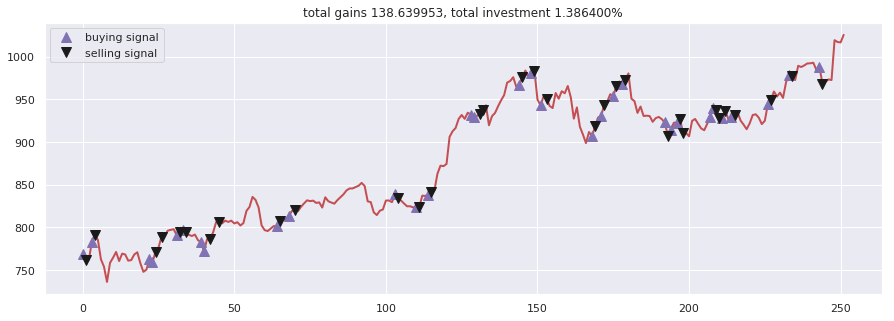

17. Actor-critic Duel Recurrent agent, [actor-critic-duel-recurrent-agent.ipynb](agent/17.actor-critic-duel-recurrent-agent.ipynb)


18. Curiosity Q-learning agent, [curiosity-q-learning-agent.ipynb](agent/18.curiosity-q-learning-agent.ipynb)

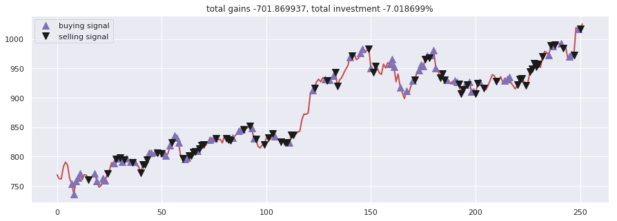

19. Recurrent Curiosity Q-learning agent, [recurrent-curiosity-q-learning.ipynb](agent/19.recurrent-curiosity-q-learning-agent.ipynb)

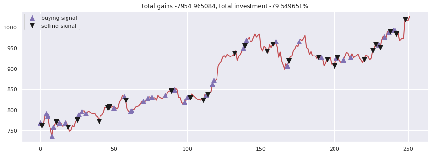

20. Duel Curiosity Q-learning agent, [duel-curiosity-q-learning-agent.ipynb](agent/20.duel-curiosity-q-learning-agent.ipynb)

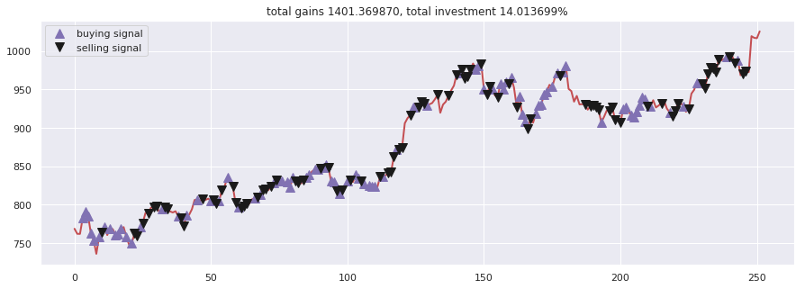

21. Neuro-evolution agent, [neuro-evolution.ipynb](agent/21.neuro-evolution-agent.ipynb)


22. Neuro-evolution with Novelty search agent, [neuro-evolution-novelty-search.ipynb](agent/22.neuro-evolution-novelty-search-agent.ipynb)

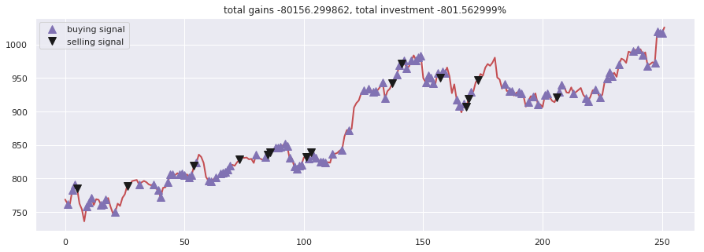

23. ABCD strategy agent, [abcd-strategy.ipynb](agent/23.abcd-strategy-agent.ipynb)

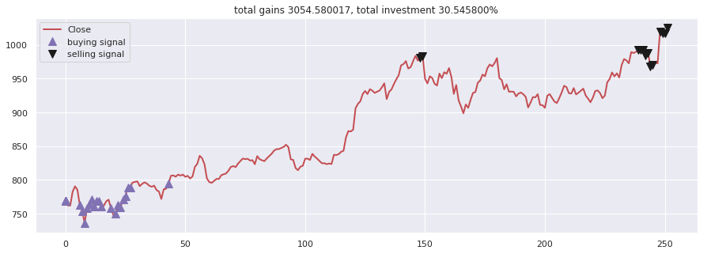

### Results free agent

**This agent able to buy or sell N-units per transaction.**

evolution strategy agent [evolution-strategy-agent.ipynb](free-agent/evolution-strategy-agent.ipynb)

```text
total gained 11037.529911, total investment 110.375299 %
```

evolution strategy with bayesian agent [evolution-strategy-bayesian-agent.ipynb](free-agent/evolution-strategy-bayesian-agent.ipynb)

```text
total gained 13295.469683, total investment 132.954697 %
```


### Results signal prediction

LSTM Recurrent Neural Network

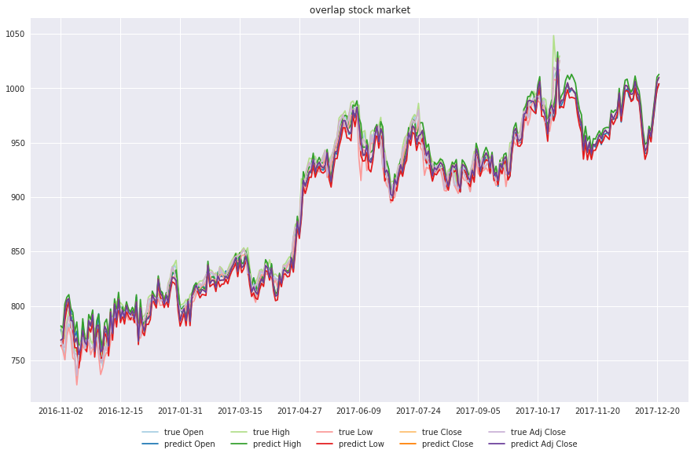

LSTM Bidirectional Neural Network


2-Path LSTM Recurrent Neural Network

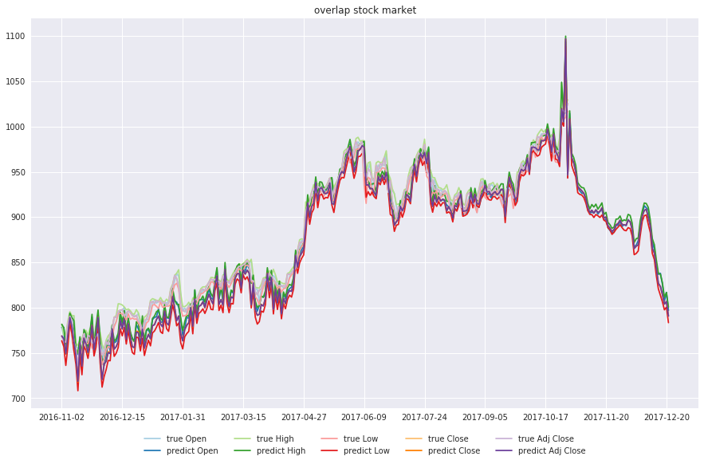

Deep Feed-forward Auto-Encoder Neural Network to reduce dimension + Deep Recurrent Neural Network + ARIMA + Extreme Boosting Gradient Regressor

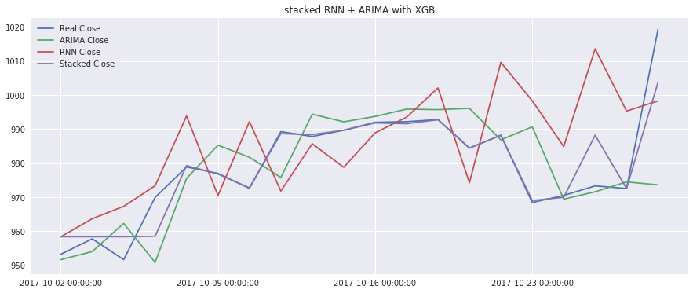

LSTM Sequence-to-Sequence Recurrent Neural Network


LSTM Sequence-to-Sequence with Attention Recurrent Neural Network


LSTM Sequence-to-Sequence with Attention Bidirectional Recurrent Neural Network


Encoder-Decoder Feed-forward + LSTM Recurrent Neural Network

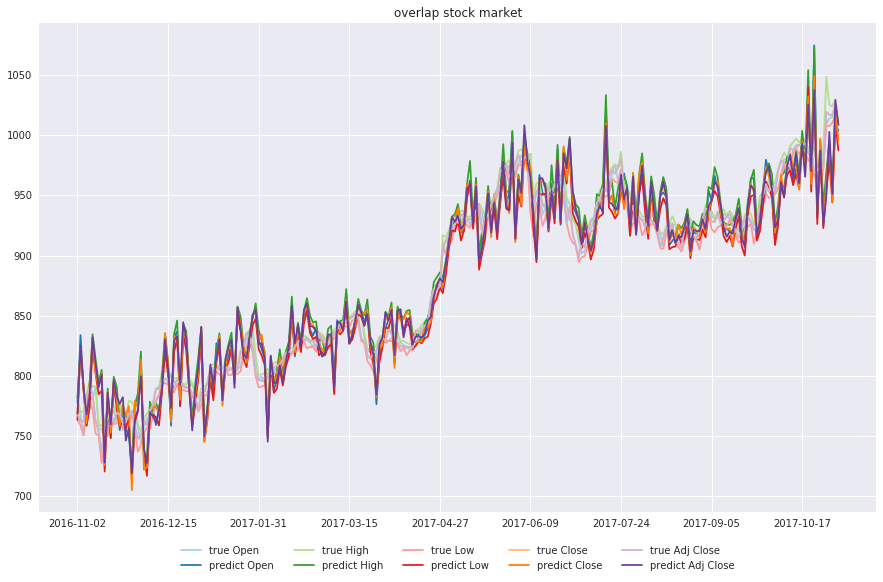

Adaboost + Bagging + Extra Trees + Gradient Boosting + Random Forest + XGB

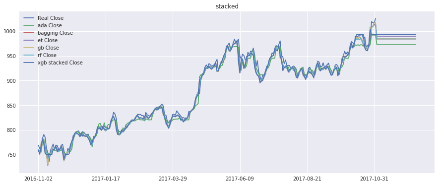
