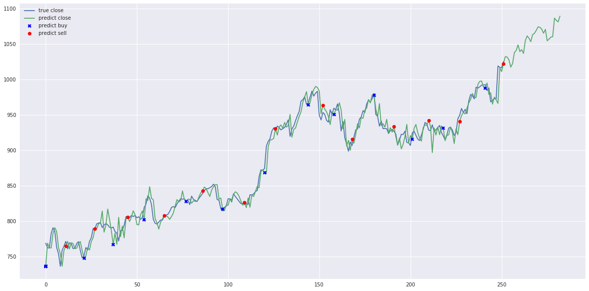

# Stock-Prediction-Comparison
Test performance and reliability of machine learning models from Stacking and Deep Learning for Stock Prediction.

## Models

#### Stacking models
  1. Deep Feed-forward Auto-Encoder Neural Network to reduce dimension + Deep Recurrent Neural Network + ARIMA + Extreme Boosting Gradient Regressor
  2. Adaboost + Bagging + Extra Trees + Gradient Boosting + Random Forest + XGB

#### Deep-learning models
 1. LSTM Recurrent Neural Network
 2. Encoder-Decoder Feed-forward + LSTM Recurrent Neural Network
 3. LSTM Bidirectional Neural Network
 4. 2-Path LSTM Recurrent Neural Network
 5. GRU Recurrent Neural Network
 6. Encoder-Decoder Feed-forward + GRU Recurrent Neural Network
 7. GRU Bidirectional Neural Network
 8. 2-Path GRU Recurrent Neural Network
 9. Vanilla Recurrent Neural Network
 10. Encoder-Decoder Feed-forward + Vanilla Recurrent Neural Network
 11. Vanilla Bidirectional Neural Network
 12. 2-Path Vanilla Recurrent Neural Network
 13. LSTM Sequence-to-Sequence Recurrent Neural Network
 14. LSTM with Attention Recurrent Neural Network
 15. LSTM Sequence-to-Sequence with Attention Recurrent Neural Network
 16. LSTM Sequence-to-Sequence Bidirectional Recurrent Neural Network
 17. LSTM Sequence-to-Sequence with Attention Bidirectional Recurrent Neural Network
 18. LSTM with Attention Scaled-Dot Recurrent Neural Network

#### Included simple backtracking on buying and selling decision, simple-investor-arima.ipynb


## Results (not included all)

```text
# buy_stock(pred, df.Close,initial_state=1,delay=4,initial_money=10000,max_buy=3,max_sell=100)
day 0: buy 3 units at price 2306.100036, total balance 7693.899964
day 11, sell 3 units at price 2313.689940, investment 0.329123 %, total balance 10007.589904,
day 21: buy 3 units at price 2306.100036, total balance 7701.489868
day 27, sell 3 units at price 2367.810060, investment 5.165892 %, total balance 10069.299928,
day 37: buy 3 units at price 2306.100036, total balance 7763.199892
day 45, sell 3 units at price 2419.950072, investment 1.907654 %, total balance 10183.149964,
day 54: buy 3 units at price 2306.100036, total balance 7877.049928
day 65, sell 3 units at price 2420.909913, investment -1.506149 %, total balance 10297.959841,
day 77: buy 3 units at price 2306.100036, total balance 7991.859805
day 86, sell 3 units at price 2516.039979, investment 1.211621 %, total balance 10507.899784,
day 97: buy 3 units at price 2306.100036, total balance 8201.799748
day 109, sell 3 units at price 2470.049928, investment 1.095242 %, total balance 10671.849676,
day 120: buy 3 units at price 2306.100036, total balance 8365.749640
day 126, sell 3 units at price 2781.390015, investment 6.048614 %, total balance 11147.139655,
day 144: buy 3 units at price 2306.100036, total balance 8841.039619
day 152, sell 3 units at price 2860.200072, investment -1.401312 %, total balance 11701.239691,
day 158: buy 3 units at price 2306.100036, total balance 9395.139655
day 168, sell 3 units at price 2720.070006, investment -5.498985 %, total balance 12115.209661,
day 180: buy 3 units at price 2306.100036, total balance 9809.109625
day 191, sell 3 units at price 2780.369934, investment -5.462395 %, total balance 12589.479559,
day 201: buy 3 units at price 2306.100036, total balance 10283.379523
day 210, sell 3 units at price 2785.350036, investment 0.406624 %, total balance 13068.729559,
day 218: buy 3 units at price 2306.100036, total balance 10762.629523
day 227, sell 3 units at price 2848.500000, investment 3.174002 %, total balance 13611.129523,
day 241: buy 3 units at price 2306.100036, total balance 11305.029487
day 251, sell 3 units at price 3076.500000, investment 3.292675 %, total balance 14381.529487,

total gained 4381.529487, total investment 43.815295 %
```


LSTM Recurrent Neural Network


LSTM Bidirectional Neural Network

.png)

2-Path LSTM Recurrent Neural Network


Deep Feed-forward Auto-Encoder Neural Network to reduce dimension + Deep Recurrent Neural Network + ARIMA + Extreme Boosting Gradient Regressor


LSTM Sequence-to-Sequence Recurrent Neural Network


LSTM Sequence-to-Sequence with Attention Recurrent Neural Network


LSTM Sequence-to-Sequence with Attention Bidirectional Recurrent Neural Network


Encoder-Decoder Feed-forward + LSTM Recurrent Neural Network


Adaboost + Bagging + Extra Trees + Gradient Boosting + Random Forest + XGB


