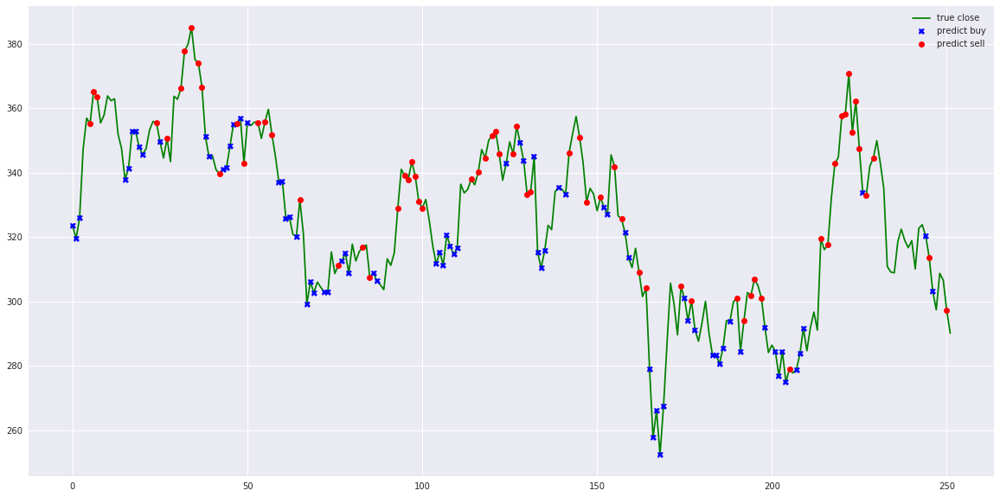
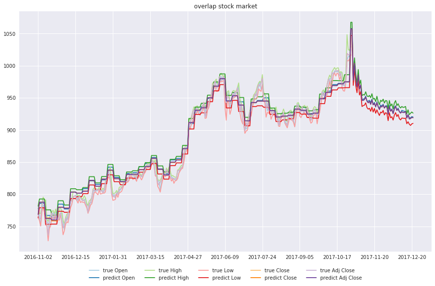
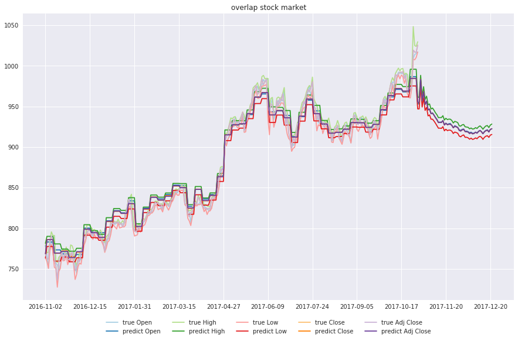
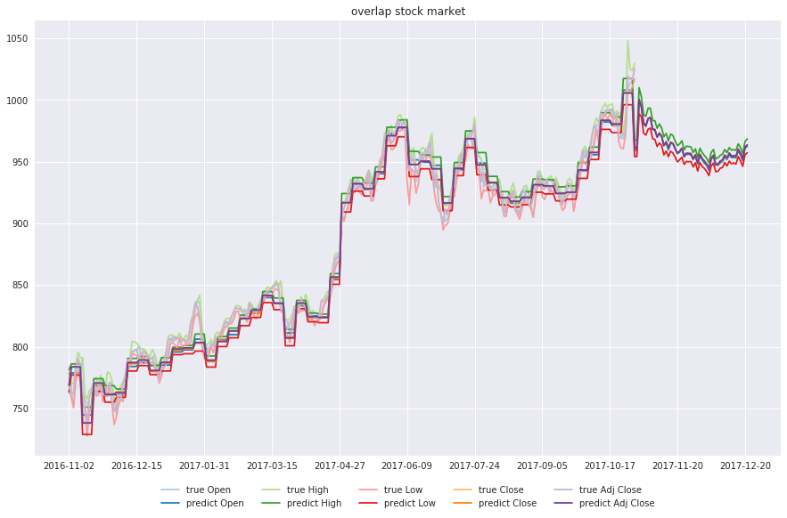

# Stock-Prediction-Models
Gathers machine learning and deep learning models for Stock forecasting, included trading bots

## Models

#### Stacking models
  1. Deep Feed-forward Auto-Encoder Neural Network to reduce dimension + Deep Recurrent Neural Network + ARIMA + Extreme Boosting Gradient Regressor
  2. Adaboost + Bagging + Extra Trees + Gradient Boosting + Random Forest + XGB

#### Deep-learning models
 1. LSTM Recurrent Neural Network
 2. Encoder-Decoder Feed-forward + LSTM Recurrent Neural Network
 3. LSTM Bidirectional Neural Network
 4. 2-Path LSTM Recurrent Neural Network
 5. GRU Recurrent Neural Network
 6. Encoder-Decoder Feed-forward + GRU Recurrent Neural Network
 7. GRU Bidirectional Neural Network
 8. 2-Path GRU Recurrent Neural Network
 9. Vanilla Recurrent Neural Network
 10. Encoder-Decoder Feed-forward + Vanilla Recurrent Neural Network
 11. Vanilla Bidirectional Neural Network
 12. 2-Path Vanilla Recurrent Neural Network
 13. LSTM Sequence-to-Sequence Recurrent Neural Network
 14. LSTM with Attention Recurrent Neural Network
 15. LSTM Sequence-to-Sequence with Attention Recurrent Neural Network
 16. LSTM Sequence-to-Sequence Bidirectional Recurrent Neural Network
 17. LSTM Sequence-to-Sequence with Attention Bidirectional Recurrent Neural Network
 18. LSTM with Attention Scaled-Dot Recurrent Neural Network
 19. LSTM with Dilated Recurrent Neural Network
 20. Only Attention Neural Network
 21. Multihead Attention Neural Network
 22. LSTM with Bahdanau Attention
 23. LSTM with Luong Attention
 24. LSTM with Bahdanau + Luong Attention
 25. DNC Recurrent Neural Network
 26. Residual LSTM Recurrent Neural Network

## Agents

1. Simple signal rolling agent
2. Q-learning deep learning agent
3. Evolution-strategy agent

#### Included stock market study on TESLA stock, tesla-study.ipynb

## Results Agent

signal rolling agent, [READ MORE](simple-agent.ipynb)

```text
total gained 185.099850, total investment 1.850998 %
```

q-learning deep learning agent [READ MORE](q-learning-agent.ipynb)

```text
total gained -108.630036, total investment -1.086300 %
```

evolution strategy agent [READ MORE](evolution-strategy-agent.ipynb)

```text
total gained 8240.610260, total investment 82.406103 %
```

evolution strategy with bayesian agent [READ MORE](evolution-strategy-bayesian-agent.ipynb)

```text
total gained 9221.279840, total investment 92.212798 %
```



## Results signal prediction

LSTM Recurrent Neural Network


LSTM Bidirectional Neural Network

.png)

2-Path LSTM Recurrent Neural Network


Deep Feed-forward Auto-Encoder Neural Network to reduce dimension + Deep Recurrent Neural Network + ARIMA + Extreme Boosting Gradient Regressor


LSTM Sequence-to-Sequence Recurrent Neural Network



LSTM Sequence-to-Sequence with Attention Recurrent Neural Network



LSTM Sequence-to-Sequence with Attention Bidirectional Recurrent Neural Network



Encoder-Decoder Feed-forward + LSTM Recurrent Neural Network


Adaboost + Bagging + Extra Trees + Gradient Boosting + Random Forest + XGB


