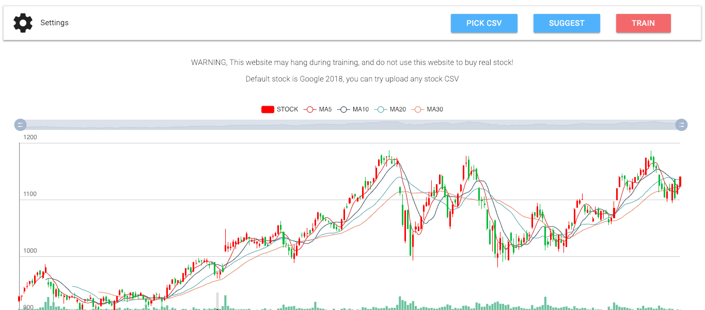
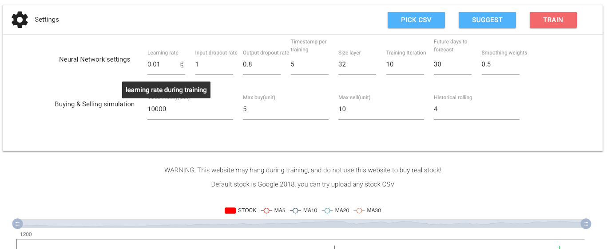
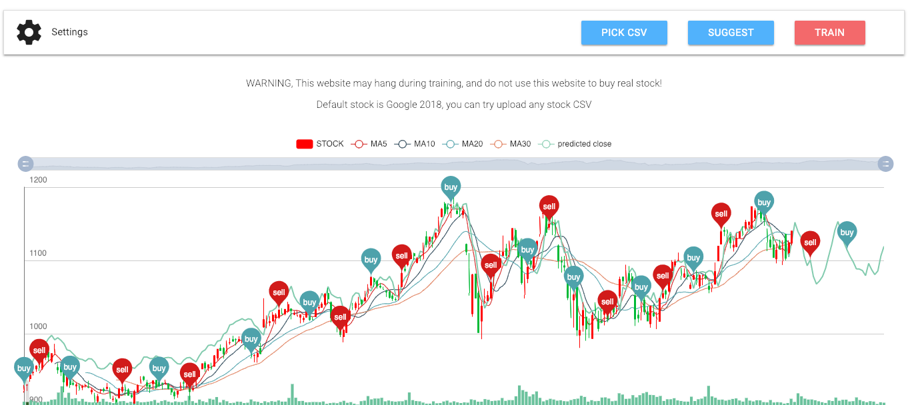
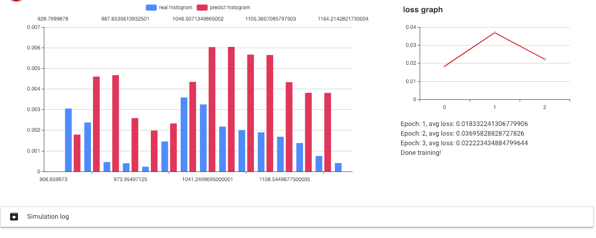

# Stock forecasting JS

LSTM Model for stock forecasting and buying simulation inside Tensorflow JS, so everyone can try!

## Stack

Graphic library: [Echarts](https://ecomfe.github.io/echarts-examples/public/index.html), [D3](https://d3js.org/)

CSV parsing: [Papaparse JS](https://www.papaparse.com/)

Linear algebra: [numeric JS](https://github.com/sloisel/numeric), [numJS](https://github.com/cliffordwolf/NumJS), [Tensorflow JS](https://js.tensorflow.org/)

## How-to

1. Clone this folder and just open [index.html](index.html),

Or, go to [huseinhouse.com/stock-forecasting-js](https://huseinhouse.com/stock-forecasting-js/)!

2. Check hyper parameters you want to tune,

3. You can upload any stock CSV, downloaded from Yahoo finance or any website. Any error, please open an issue.

4. Train the model and wait it's fitting!

5. After done training, it will predict where to buy and sell,

Comparing histogram and loss graph,

